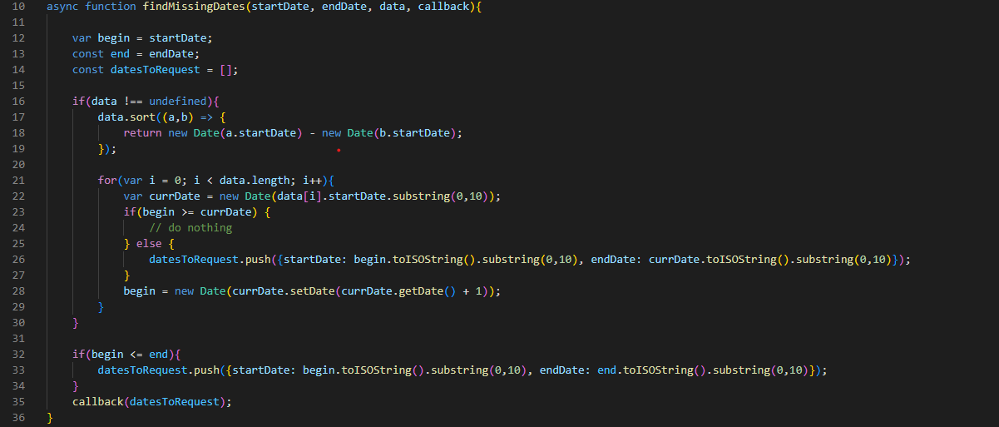
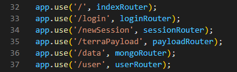
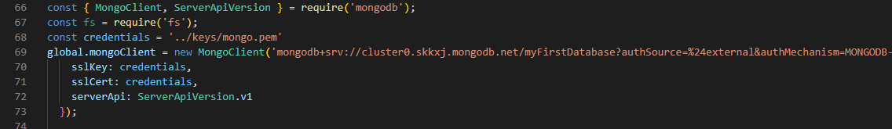

[__Back to home__](../index.md)

# The Project Repository

[https://github.com/kc319/TerraDemo](https://github.com/kc319/TerraDemo)

# Code and Resources

## Unique User Session ID

- Each time a user starts a session by going to the website in their brower, a unique session ID is created and passed within the states of the React DOM
- This ID is created using a sha256 Hash, using the Current time and a random pertubated string as a key, meaning 2 users would have to access the website at the exact same second ( very unlikely ) and be given the exact same random string, to have the same ID. This is quite impossible
- The use of a Hashing ID is to anonamize their userID and the connected wearables on the database, IN CASE of a breach or leak, instead of having a simple 0-x ID created based on the number of registered users, and to provide users with privacy guarantees

## User Suggestions

- Our Suggestions engine automatically finds correlations and relations between different data sets from different wearables.
- The available data sets are stores in DashboardMoz class state, and passed to the General Suggestions file
- Here, we use a large match case statement, to outout different suggestions based on the type of suggestion we want to provide
- Then based on the available datasets, we can detect averge/outlier trends in the user's health data, based on scientific knoweldge of the human body, to generate meaningful suggestions back to the main Dahsboard Class, where they are outputted on the page

## Change Main Page Graph Time Scales

- By default, all Dashboard Cards display data with a timescale of 30 days
- However, using the 3 dot drop down menu on each dashboard card, we can change the timescale to 1 week, 1 month, or 3 months
- Users can use this to get a better understanding of their recent health data, or a larger scale understanding over a bigger range

## Connect wearable accounts to unique user session

- On Guest login, or upon clicking the terra widget icon on the sidebar, users will be taken to a new browser page with the Terra Wdiget
- Here they can login and connect any of their wearable accounts to their current session

- On successful closing of the window, a delete signal is sent to the backend, to delete the users unique session id

## Selective Data Requests Based On Missing Dates

- Since the user could potentially request data from various time periods it would be inefficient to ask Terra for data we already have stored in our database.
- This function finds the dates for which we do not have data and only requests these from Terra.

## Using Express's Router To Divide Code

- Express has an in-built router package that allowed us to reduce the code in the main app.js file and seperate it into different files depending on the purpose of each particular route.
- These routes deal with different frontend concerns such as anything to do with the user.

## Setting Up MongoDB

- A global mongo object is setup before the server is launched that can be used for any connection to the database.
- It requires a key not provided in the source repository.

## Terra Integration
- [https://docs.tryterra.co/integrating-with-terra](https://docs.tryterra.co/integrating-with-terra)

## React App (frontend):
- [https://github.com/facebook/create-react-app](https://github.com/facebook/create-react-app)

## Authentication Setup
- [https://www.digitalocean.com/community/tutorials/how-to-add-login-authentication-to-react-applications](https://www.digitalocean.com/community/tutorials/how-to-add-login-authentication-to-react-applications
)

## NodeJS Tutorial
- [https://www.youtube.com/watch?v=zb3Qk8SG5Ms&list=PL4cUxeGkcC9jsz4LDYc6kv3ymONOKxwBU](https://www.youtube.com/watch?v=zb3Qk8SG5Ms&list=PL4cUxeGkcC9jsz4LDYc6kv3ymONOKxwBU)

## MongoDB
- [https://www.mongodb.com/docs/](https://www.mongodb.com/docs/)

## Tailwind Dashboard
- [https://github.com/cruip/tailwind-dashboard-template](https://github.com/cruip/tailwind-dashboard-template)
- [https://www.smashingmagazine.com/2020/02/tailwindcss-react-project/](https://www.smashingmagazine.com/2020/02/tailwindcss-react-project/)
- [https://www.ceos3c.com/web-development/react-and-tailwind-beginner-guide/](https://www.ceos3c.com/web-development/react-and-tailwind-beginner-guide/)
- [https://frontbackgeek.com/how-to-add-tailwind-css-in-react-js-application/](https://frontbackgeek.com/how-to-add-tailwind-css-in-react-js-application/)
- [https://tailwindcss.com/docs/customizing-colors](https://tailwindcss.com/docs/customizing-colors)
- [https://tailwind-elements.com/docs/standard/components/charts/](https://tailwind-elements.com/docs/standard/components/charts/)

## Habitdash Dashboard (Competitor)
- [https://habitdash.com/](https://habitdash.com/)

## Leaflet & Poster Design:
- [https://www.canva.com/](https://www.canva.com/)

## Heart Rate Health Analysis:
- [https://www.bhf.org.uk/informationsupport/how-a-healthy-heart-works/your-heart-rate](https://www.bhf.org.uk/informationsupport/how-a-healthy-heart-works/your-heart-rate)
- [https://www.heart.org/en/health-topics/high-blood-pressure/the-facts-about-high-blood-pressure/all-about-heart-rate-pulse](https://www.heart.org/en/health-topics/high-blood-pressure/the-facts-about-high-blood-pressure/all-about-heart-rate-pulse)
- [https://armstrongbodysystems.com/heart-rate-chart/](https://armstrongbodysystems.com/heart-rate-chart/)

## Nutrition Guidelines:
- [https://assets.publishing.service.gov.uk/government/uploads/system/uploads/attachment_data/file/618167/government_dietary_recommendations.pdf] (https://assets.publishing.service.gov.uk/government/uploads/system/uploads/attachment_data/file/618167/government_dietary_recommendations.pdf)

## React Component LifeCycle:
- [https://www.educba.com/react-component-lifecycle/](https://www.educba.com/react-component-lifecycle/)
- [https://reactjs.org/docs/react-component.html#render](https://reactjs.org/docs/react-component.html#render)
- [https://www.tutorialspoint.com/reactjs/reactjs_component_life_cycle.htm](https://www.tutorialspoint.com/reactjs/reactjs_component_life_cycle.htm)
- [https://www.geeksforgeeks.org/reactjs-componentdidmount-method/#:~:text=ReactJS%20componentDidMount%20%28%29%20Method.%20The%20componentDidMount%20%28%29%20method,be%20coded%20in%20the%20componentDidMount%20%28%29%20method%20block.](https://www.geeksforgeeks.org/reactjs-componentdidmount-method/#:~:text=ReactJS%20componentDidMount%20%28%29%20Method.%20The%20componentDidMount%20%28%29%20method,be%20coded%20in%20the%20componentDidMount%20%28%29%20method%20block.)
- [https://projects.wojtekmaj.pl/react-lifecycle-methods-diagram/](https://projects.wojtekmaj.pl/react-lifecycle-methods-diagram/)

## React Rendering
- [https://linguinecode.com/post/4-methods-to-re-render-react-component](https://linguinecode.com/post/4-methods-to-re-render-react-component)
- [https://felixgerschau.com/react-rerender-components/](https://felixgerschau.com/react-rerender-components/)
- [https://www.pluralsight.com/guides/how-to-execute-javascript-after-reactjs-render-method-has-completed](https://www.pluralsight.com/guides/how-to-execute-javascript-after-reactjs-render-method-has-completed)

## Learning React Techniques and Rules
- [https://reactjs.org/docs/conditional-rendering.html](https://reactjs.org/docs/conditional-rendering.html)
- [https://upmostly.com/tutorials/react-onchange-events-with-examples](https://upmostly.com/tutorials/react-onchange-events-with-examples)
- [https://medium.com/codex/how-to-use-array-in-reactjs-2a30d8b72503](https://medium.com/codex/how-to-use-array-in-reactjs-2a30d8b72503)
- [https://upmostly.com/tutorials/react-onchange-events-with-examples](https://upmostly.com/tutorials/react-onchange-events-with-examples)
- [https://developer.mozilla.org/en-US/docs/Web/JavaScript/Reference/Global_Objects/Array/findIndex?retiredLocale=vi](https://developer.mozilla.org/en-US/docs/Web/JavaScript/Reference/Global_Objects/Array/findIndex?retiredLocale=vi)
- [https://reactgo.com/react-for-loop/](https://reactgo.com/react-for-loop/)
- [https://www.codespeedy.com/what-is-useeffect-hook-in-react-js/#:~:text=The%20purpose%20of%20the%20useEffect%20hook%20in%20React,or%20reading%20from%20local%20storage%2C%20and%20many%20more.](https://www.codespeedy.com/what-is-useeffect-hook-in-react-js/#:~:text=The%20purpose%20of%20the%20useEffect%20hook%20in%20React,or%20reading%20from%20local%20storage%2C%20and%20many%20more.)

## React Hooks:
- [https://reactjs.org/warnings/invalid-hook-call-warning.html](https://reactjs.org/warnings/invalid-hook-call-warning.html)
- [https://reactjs.org/docs/hooks-intro.html](https://reactjs.org/docs/hooks-intro.html)
- [https://reactjs.org/docs/hooks-reference.html](https://reactjs.org/docs/hooks-reference.html)

## React UseState Hooks:
- [https://www.w3schools.com/react/react_usestate.asp](https://www.w3schools.com/react/react_usestate.asp)
- [https://reactjs.org/docs/hooks-state.html](https://reactjs.org/docs/hooks-state.html)
- [https://blog.logrocket.com/a-guide-to-usestate-in-react-ecb9952e406c/](https://blog.logrocket.com/a-guide-to-usestate-in-react-ecb9952e406c/)
- [https://linguinecode.com/post/why-react-setstate-usestate-does-not-update-immediately](https://linguinecode.com/post/why-react-setstate-usestate-does-not-update-immediately)

## React Router:
- [https://www.w3schools.com/react/react_router.asp](https://www.w3schools.com/react/react_router.asp)
- [https://reactrouterdotcom.fly.dev/docs/en/v6/routers/browser-router](https://reactrouterdotcom.fly.dev/docs/en/v6/routers/browser-router)
- [https://medium.com/how-to-react/how-to-use-react-router-in-your-react-js-project-7e1d469a9716#:~:text=How%20to%20use%20React%20Router%20in%20your%20React,useLocation.%20...%205%20useHistory.%20...%206%20Redirect.%20](https://medium.com/how-to-react/how-to-use-react-router-in-your-react-js-project-7e1d469a9716#:~:text=How%20to%20use%20React%20Router%20in%20your%20React,useLocation.%20...%205%20useHistory.%20...%206%20Redirect.%20)

## Express:
- [https://expressjs.com/en/api.html](https://expressjs.com/en/api.html)
- [https://www.robinwieruch.de/node-express-server-rest-api/](https://www.robinwieruch.de/node-express-server-rest-api/)